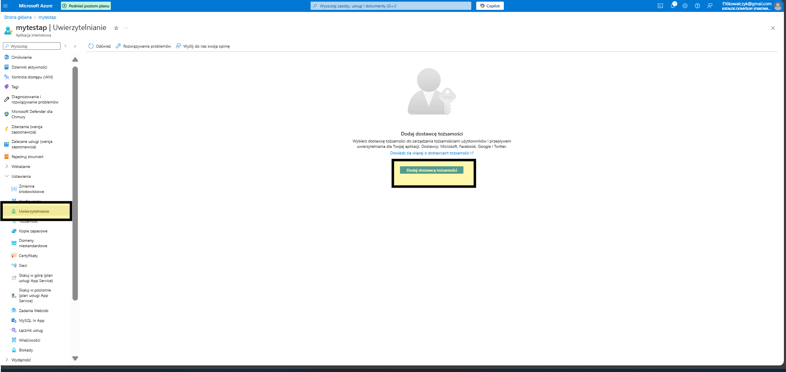

# Azure_App_Authentication
 How to add Authentication process to app.

 For add authentication to your app go to settings and click on authentication.

 

 next click and and take provider.

 

 Next config all details:

 

 

 For test the process check below

 

 like you see everything workig ok :)

 

 
